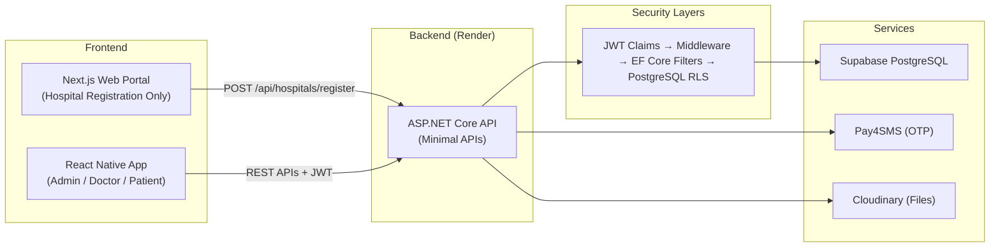
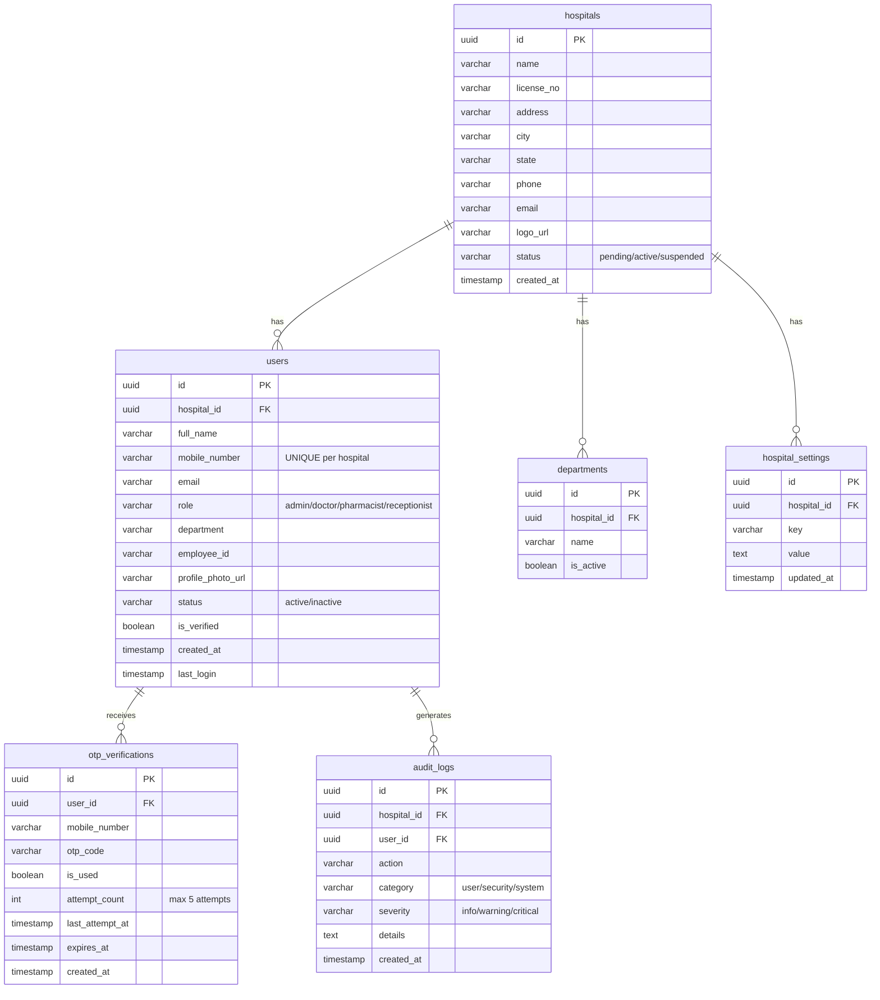
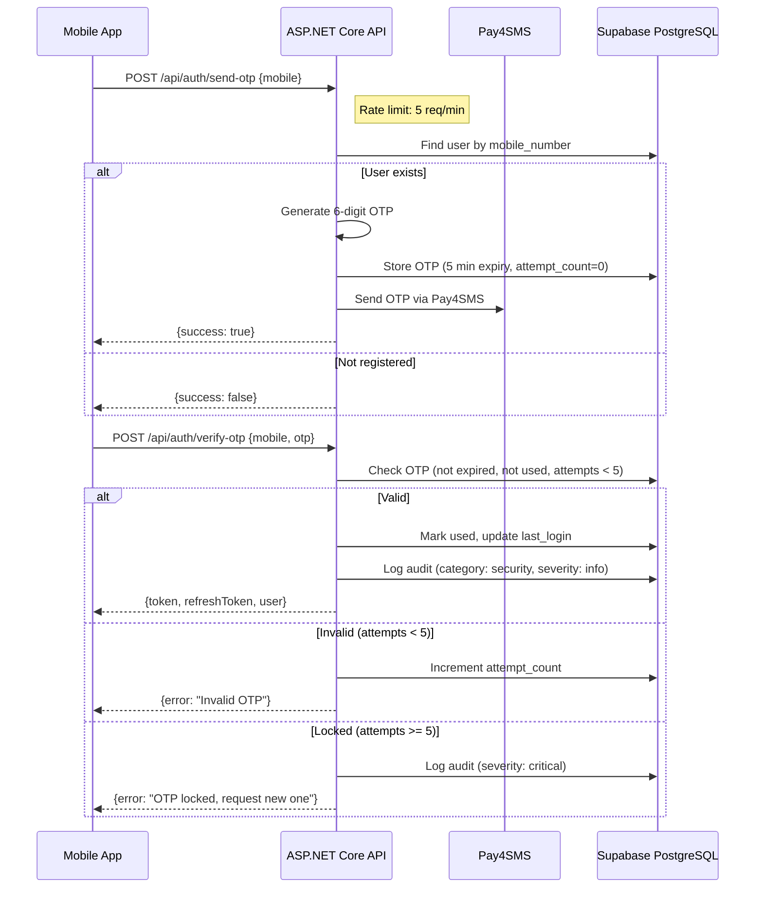
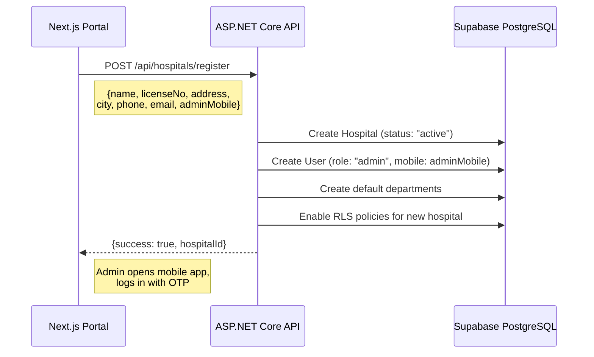

# Nalam Backend — Implementation Plan (Final, Merged)

A multi-tenant telemedicine SaaS backend. Hospitals register via web portal → registered mobile becomes the Admin. All auth is **mobile OTP only** (Pay4SMS). Admin manages everything from the React Native app.

---

## Architecture Overview



---

## 🔐 Security: Defense-in-Depth (4 Layers)

Tenant isolation is enforced at **every layer** to prevent data leakage:

| Layer | Mechanism | Purpose |
|-------|-----------|---------|
| 1. JWT Claims | `hospital_id` + `role` in token | Identity & tenant context |
| 2. Middleware | `TenantMiddleware` sets `app.current_hospital_id` in PG session | DB-level context injection |
| 3. EF Core | Global Query Filters on all tenant entities | Application-level filtering |
| 4. PostgreSQL | Row-Level Security (RLS) policies | Final safety net — DB enforced |

### Security Best Practices
- **Never** accept `hospital_id` from request body — always extract from JWT
- Validate all JWT tokens on every request
- Avoid raw SQL without tenant filtering
- Enforce RLS on **every** tenant table

---

## Database Schema (Multi-Tenant with RLS)

> [!IMPORTANT]
> All tenant tables have `hospital_id` FK + RLS policies enforcing `hospital_id = current_setting('app.current_hospital_id')`.



### PostgreSQL RLS Setup
```sql
-- Enable RLS on all tenant tables
ALTER TABLE users ENABLE ROW LEVEL SECURITY;
ALTER TABLE departments ENABLE ROW LEVEL SECURITY;
ALTER TABLE audit_logs ENABLE ROW LEVEL SECURITY;
ALTER TABLE hospital_settings ENABLE ROW LEVEL SECURITY;
ALTER TABLE otp_verifications ENABLE ROW LEVEL SECURITY;

-- Create isolation policy (repeat for all tables with hospital_id)
CREATE POLICY hospital_isolation_policy ON users
  USING (hospital_id = current_setting('app.current_hospital_id')::uuid);
```

---

## ASP.NET Core Project Structure

```
NalamApi/
├── Program.cs                    # App entry, DI, rate limiting, auth policies
├── appsettings.json              # DB, JWT, Pay4SMS, Cloudinary config
├── Dockerfile
├── Data/
│   ├── NalamDbContext.cs          # EF Core + Global Query Filters
│   └── Migrations/
├── Entities/
│   ├── Hospital.cs
│   ├── User.cs
│   ├── OtpVerification.cs        # +attempt_count, +last_attempt_at
│   ├── Department.cs
│   ├── HospitalSetting.cs
│   └── AuditLog.cs               # +severity field
├── DTOs/
│   ├── Auth/
│   ├── Admin/
│   └── Hospital/
├── Endpoints/
│   ├── AuthEndpoints.cs          # Rate-limited OTP endpoints
│   ├── AdminEndpoints.cs         # AdminOnly policy enforced
│   └── HospitalEndpoints.cs
├── Services/
│   ├── OtpService.cs             # Pay4SMS + retry logic (max 5 attempts)
│   ├── JwtService.cs             # Token with hospital_id + role claims
│   ├── AuditService.cs           # Centralized audit logging with severity
│   └── CloudinaryService.cs
└── Middleware/
    └── TenantMiddleware.cs       # Injects hospital_id into PG session
```

### Key Code Patterns

**TenantMiddleware** — injects hospital context into PostgreSQL:
```csharp
public async Task Invoke(HttpContext context, NalamDbContext db)
{
    var hospitalId = context.User.FindFirst("hospitalId")?.Value;
    if (!string.IsNullOrEmpty(hospitalId))
    {
        await db.Database.ExecuteSqlRawAsync(
            $"SET app.current_hospital_id = '{hospitalId}'");
    }
    await _next(context);
}
```

**EF Core Global Query Filters**:
```csharp
modelBuilder.Entity<User>()
    .HasQueryFilter(u => u.HospitalId == _currentHospitalId);
```

**Rate Limiting** on OTP endpoints:
```csharp
builder.Services.AddRateLimiter(options =>
{
    options.AddFixedWindowLimiter("otp", opt =>
    {
        opt.PermitLimit = 5;
        opt.Window = TimeSpan.FromMinutes(1);
    });
});
// Applied to: /api/auth/send-otp, /api/auth/verify-otp
```

**Role-Based Authorization**:
```csharp
builder.Services.AddAuthorization(options =>
{
    options.AddPolicy("AdminOnly", policy =>
        policy.RequireClaim("role", "admin"));
});
```

---

## API Endpoints

### Authentication (Rate-Limited: 5 req/min)
| Method | Endpoint | Description |
|--------|----------|-------------|
| `POST` | `/api/auth/send-otp` | Send OTP via Pay4SMS (rate limited) |
| `POST` | `/api/auth/verify-otp` | Verify OTP → JWT (max 5 attempts, then lock) |
| `POST` | `/api/auth/refresh` | Refresh expired access token |

### Hospital Registration (Public)
| Method | Endpoint | Description |
|--------|----------|-------------|
| `POST` | `/api/hospitals/register` | Register hospital + auto-create admin |

### Admin — User Management (`AdminOnly` policy)
| Method | Endpoint | Description |
|--------|----------|-------------|
| `GET` | `/api/admin/users` | List users (search, filter by role/status) |
| `POST` | `/api/admin/users` | Create new user |
| `GET` | `/api/admin/users/{id}` | Get user details |
| `PUT` | `/api/admin/users/{id}` | Update user info |
| `PATCH` | `/api/admin/users/{id}/status` | Activate / deactivate |
| `PATCH` | `/api/admin/users/{id}/role` | Change role |
| `DELETE` | `/api/admin/users/{id}` | Remove user |

### Admin — Dashboard & Settings (`AdminOnly` policy)
| Method | Endpoint | Description |
|--------|----------|-------------|
| `GET` | `/api/admin/dashboard` | Stats (total users, active, pending) |
| `GET` | `/api/admin/activity` | Recent activity feed (with severity) |
| `GET` | `/api/admin/settings` | Get hospital settings |
| `PUT` | `/api/admin/settings` | Update settings |
| `GET` | `/api/admin/profile` | Get own profile |
| `PUT` | `/api/admin/profile` | Update own profile |

---

## Authentication Flow (with OTP Security)



## Hospital Registration Flow



---

## Audit Logging — Critical Actions

| Action | Category | Severity |
|--------|----------|----------|
| Login success | security | info |
| OTP failure | security | warning |
| OTP locked (5 attempts) | security | critical |
| User created | user | info |
| User deactivated | user | warning |
| Role changed | user | warning |
| Settings updated | system | info |
| User deleted | user | critical |

---

## Proposed Changes

### [NEW] `NalamApi/` — ASP.NET Core Backend
- EF Core + Npgsql, JWT auth, Pay4SMS OTP, Cloudinary
- Defense-in-Depth: JWT → Middleware → EF Core Filters → PostgreSQL RLS
- Rate limiting, role-based policies, audit logging with severity
- Dockerfile for Render

### [MODIFY] Mobile App
- [login.tsx](file:///Volumes/BSB/Nalam-app/app/admin/login.tsx) — Remove Employee ID mode, OTP only
- [otp.tsx](file:///Volumes/BSB/Nalam-app/app/admin/otp.tsx) — Connect to real verify-otp API
- [authStore.ts](file:///Volumes/BSB/Nalam-app/stores/authStore.ts) — Add token, hospitalId, persistence
- [NEW] `services/api.ts` — Axios + JWT interceptor + auto-refresh
- Admin screens — Replace mock data with real API calls

---

## Roadmap Recommendations

| Timeframe | Action |
|-----------|--------|
| **Now** | Rate limiting, RLS, OTP retry limits |
| **Mid-term** | Background jobs (OTP cleanup, log rotation), Serilog |
| **Long-term** | Microservices split (Auth, Billing, Consultation) |

---

## Verification Plan

### API Testing
1. Register hospital → verify hospital + admin created
2. Send OTP → verify generation (console log without Pay4SMS key)
3. Verify OTP → check JWT has `hospital_id` + `role` claims
4. List users with JWT → verify **only same-hospital users** returned (RLS test)
5. Create user → verify correct `hospital_id` assigned
6. Test OTP lockout after 5 failed attempts
7. Test rate limiting (6th request within 1 min should be rejected)

### Mobile App Testing
1. Admin login → OTP → dashboard with real data
2. Users tab → CRUD operations → verify persistence
3. Settings → update → verify after restart
